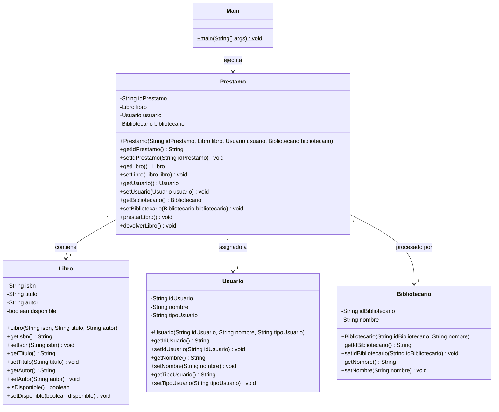

# Diagrama de Clases UML - Sistema de Gestión de Biblioteca

```mermaid
classDiagram
    class Libro {
        -String isbn
        -String titulo
        -String autor
        -boolean disponible
        +Libro(String isbn, String titulo, String autor)
        +getIsbn() String
        +setIsbn(String isbn) void
        +getTitulo() String
        +setTitulo(String titulo) void
        +getAutor() String
        +setAutor(String autor) void
        +isDisponible() boolean
        +setDisponible(boolean disponible) void
    }

    class Usuario {
        -String idUsuario
        -String nombre
        -String tipoUsuario
        +Usuario(String idUsuario, String nombre, String tipoUsuario)
        +getIdUsuario() String
        +setIdUsuario(String idUsuario) void
        +getNombre() String
        +setNombre(String nombre) void
        +getTipoUsuario() String
        +setTipoUsuario(String tipoUsuario) void
    }

    class Bibliotecario {
        -String idBibliotecario
        -String nombre
        +Bibliotecario(String idBibliotecario, String nombre)
        +getIdBibliotecario() String
        +setIdBibliotecario(String idBibliotecario) void
        +getNombre() String
        +setNombre(String nombre) void
    }

    class Prestamo {
        -String idPrestamo
        -Libro libro
        -Usuario usuario
        -Bibliotecario bibliotecario
        +Prestamo(String idPrestamo, Libro libro, Usuario usuario, Bibliotecario bibliotecario)
        +getIdPrestamo() String
        +setIdPrestamo(String idPrestamo) void
        +getLibro() Libro
        +setLibro(Libro libro) void
        +getUsuario() Usuario
        +setUsuario(Usuario usuario) void
        +getBibliotecario() Bibliotecario
        +setBibliotecario(Bibliotecario bibliotecario) void
        +prestarLibro() void
        +devolverLibro() void
    }

    class Main {
        +main(String[] args)$ void
    }

    Prestamo "1" --> "1" Libro : contiene
    Prestamo "*" --> "1" Usuario : asignado a
    Prestamo "*" --> "1" Bibliotecario : procesado por
    Main ..> Prestamo : ejecuta
```